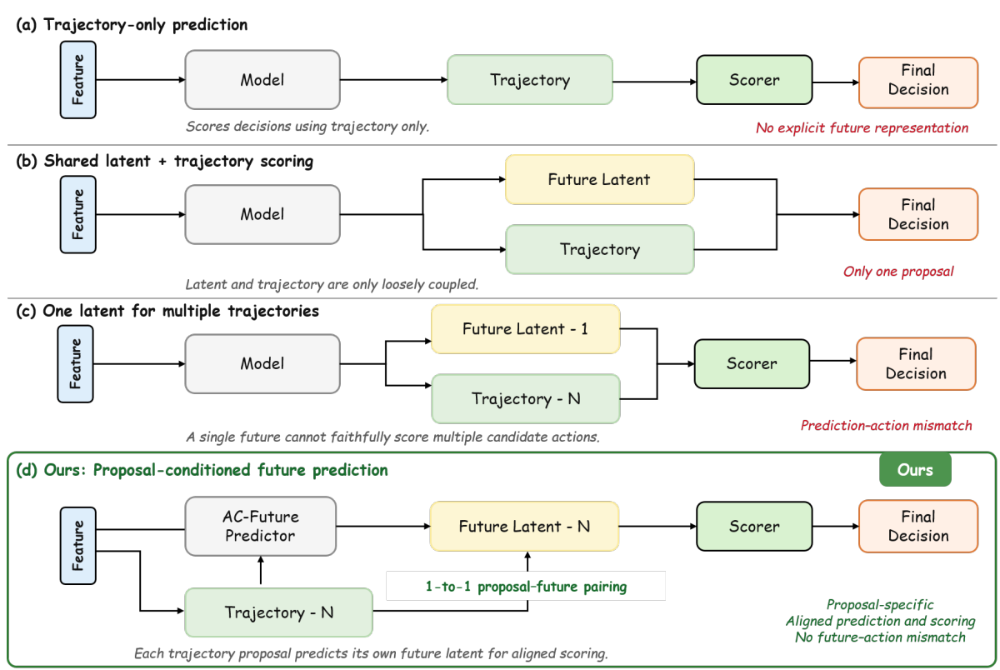
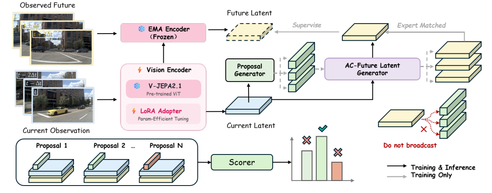
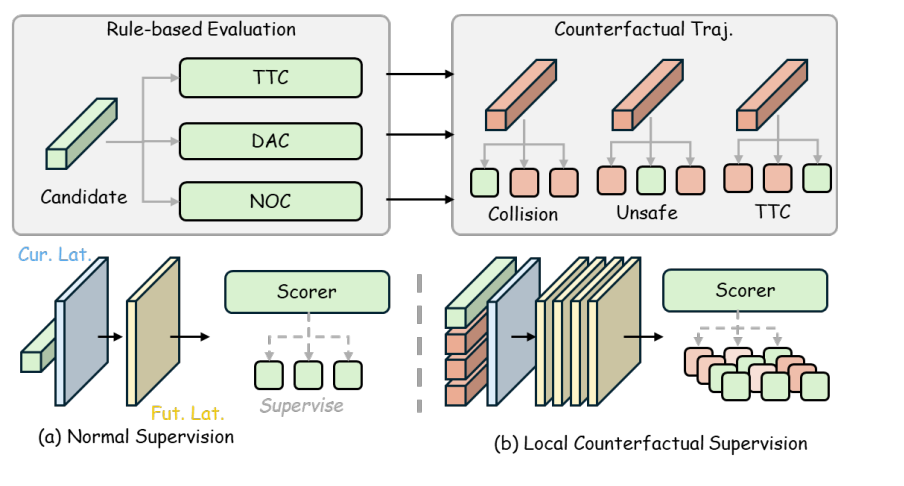
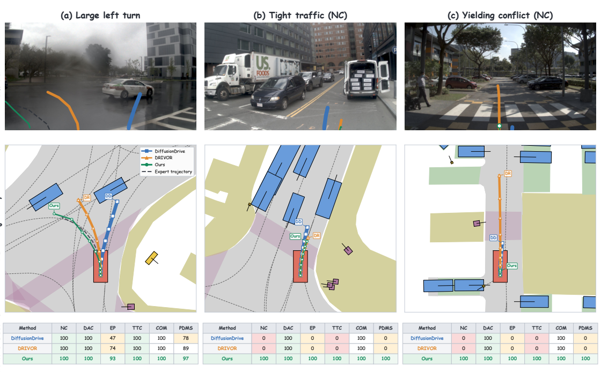

# 论文笔记：DA-WAM: Decision-Aligned Future Latents for Driving World Models

## 元信息

| 项目 | 内容 |
|---|---|
| 机构 | 香港科技大学（广州）、零跑汽车、香港科技大学 |
| 日期 | arXiv v2：2026-08-20 |
| 论文 | [arXiv HTML](https://arxiv.org/html/2608.19085) · [PDF](https://arxiv.org/pdf/2608.19085) |
| 代码 | [LeapWM/da-wam](https://github.com/LeapWM/da-wam)；截至笔记创建时仓库为占位 README，尚无实现 |
| 本地附件 | Zotero ItemID 1411，PDF 附件位于 Zotero storage/NEZ7LUID |
| 对比方向 | World4Drive、DriveFuture、Latent-WAM、DrivoR、DriveSuprim |

---

## 一句话总结

> 为每条候选轨迹预测专属未来潜变量，并用该未来直接参与评分；训练时让未来表征与规划目标共同优化。

---

## 核心贡献

1. **候选与未来一一对应**：每条轨迹都有动作条件的未来潜变量，评分器读取其对应预测结果。
2. **预测表征持续适应规划**：预训练 V-JEPA 2.1 的在线分支用 LoRA 更新；EMA 目标分支在训练时提供稳定未来特征。
3. **尊重离线反事实缺失**：真实未来只监督专家匹配候选；其他候选由规划指标和排序监督，外加专家附近的安全关键难负例。

---

## 问题背景

### 要解决的问题

驾驶[[世界模型]]需要回答：在相同当前场景下，自车分别执行候选轨迹 $\tau_1,\ldots,\tau_N$，会产生什么不同后果？规划器又是否真正依据这些后果选择轨迹？

### 现有方法的局限

- 未来预测常用于预训练、辅助训练或表征增强，预测分支可能在推理时被丢弃，评分器并不直接使用预测未来。
- 部分方案对多条候选共享或汇聚一个未来表征，形成“轨迹不同、后果相同”的动作—预测错配。
- 离线日志只观测到实际执行轨迹的后续图像，其他动作的真实反事实图像不可得。

### 本文的动机

作者认为，未来预测的规划价值取决于它是否直接改变候选级[[轨迹评分]]。因此将当前视觉、候选动作、候选专属未来三者绑定，并让未来预测损失贯穿规划训练。

---

## 方法详解

### 模型架构

- **输入**：前视相机的两帧历史图像 $X_t$；候选生成器提出的 $N=32$ 条轨迹，每条包含 8 个未来自车位姿。
- **在线视觉编码器**：预训练[[V-JEPA]] 2.1 主干冻结，在选定 Transformer 层训练[[LoRA]]，输出 $M\times D$ 个当前场景 token。
- **训练目标编码器**：用[[EMA]] 更新的分支读取实际观测到的 $X_{t+\Delta}$，提供停止梯度的潜变量目标；推理时移除。
- **动作条件预测器**：轨迹编码为动作查询，对当前场景 token 做交叉注意力，为每条候选预测 0.5 秒后的 $\widehat Z_i$。
- **共享评分器**：联合读取 $Z_t,a_i,\widehat Z_i$，预测 NC、DAC、EP、TTC、Comfort 五个因子及总体效用 $\widehat s_i$。
- **输出**：选取 $\arg\max_i\widehat s_i$ 对应的候选轨迹。
- **参数量**：论文未报告总参数量；也未给出完整的推理时延与显存开销。

### 核心模块 1：持续更新的预测表征

在线编码器的 LoRA 同时接收潜变量预测与规划损失的梯度。目标编码器通过 EMA 缓慢移动，训练期间保持预测目标相对稳定。与“先预训练、后冻结”的流程相比，表征可随轨迹选择任务调整。EMA 稳定目标的作用是作者的设计动机；仅凭规划分数不能单独证明其消除了所有表征坍塌风险。

### 核心模块 2：候选专属[[反事实预测]]

共享预测器参数并不意味着共享未来：每个动作查询 $a_i$ 与同一当前场景 $Z_t$ 交互，形成不同的 $\widehat Z_i$。这里的未来是潜空间 token，并非可直接观察的未来视频或显式多智能体轨迹。未执行候选的潜变量没有真实视觉标签，因此其反事实准确性不能直接由训练损失确认。

### 核心模块 3：因子化评分与[[困难负例]]

因子头输出 NC（无责任碰撞）、DAC（可行驶区域遵守）、EP（行驶进度）、TTC（碰撞时间）、Comfort（舒适性），效用头读取联合特征及因子预测值。训练时从轨迹库检索与专家几何上接近、安全指标却显著更差的候选，强化安全边界附近的排序学习。难负例仍没有观测未来图像，只获得规划因子、效用和排序标签。

### 训练与推理过程

1. **训练**：编码当前与实际未来；生成并编码候选；为每条候选预测潜变量；将最接近专家轨迹的候选与真实未来潜变量对齐；所有候选参与因子、效用、排序损失。
2. **推理**：只使用当前图像、候选生成器、在线编码器、预测器及评分器；无需未来图像、专家轨迹、EMA 目标分支或难负例检索。

---

## 关键公式

以下按论文公式编号完整列出。$M$ 为 token 数，$D$ 为维度，$N$ 为候选数，$\Delta$ 为预测时间间隔；详见末尾 Table 6。

### 公式 1：[[V-JEPA|当前场景编码]]

$$
Z_t=E_\theta(X_t).
$$

**含义**：在线视觉编码器将当前观测转为场景潜变量。**符号**：$X_t$ 为当前视觉输入；$E_\theta$ 为在线编码器；$Z_t\in\mathbb R^{M\times D}$。

### 公式 2：[[V-JEPA|未来目标编码]]

$$
Z_{t+\Delta}=\operatorname{sg}\left(E_{\bar\theta}(X_{t+\Delta})\right).
$$

**含义**：用目标分支提取实际未来特征并停止梯度。**符号**：$X_{t+\Delta}$ 为日志中的未来视觉；$E_{\bar\theta}$ 为目标编码器；$\operatorname{sg}$ 为停止梯度。

### 公式 3：[[EMA|目标编码器动量更新]]

$$
\bar\theta\leftarrow\mu\bar\theta+(1-\mu)\theta.
$$

**含义**：目标权重跟随在线权重缓慢变化。**符号**：$\bar\theta,\theta$ 分别是目标和在线权重；$\mu\in[0,1)$ 为动量系数。

### 公式 4：[[轨迹评分|候选动作编码]]

$$
a_i=E_\tau(\tau_i).
$$

**含义**：将第 $i$ 条未来自车轨迹编码为动作表征。**符号**：$\tau_i$ 为候选轨迹；$E_\tau$ 为轨迹编码器；$a_i$ 为动作查询。

### 公式 5：[[反事实预测|动作条件未来潜变量]]

$$
\widehat Z_i=P_\phi\left(Q=a_i,K=Z_t,V=Z_t\right),\qquad i=1,\ldots,N.
$$

**含义**：每条轨迹用自己的动作查询读取当前场景，得到专属预测未来。**符号**：$P_\phi$ 为共享预测器；$Q,K,V$ 是注意力查询、键、值；$\widehat Z_i$ 是候选 $i$ 的未来潜变量。

### 公式 6：[[ADE|专家候选匹配]]

$$
i^{\mathrm{exp}}=\arg\min_i\operatorname{ADE}\left(\tau_i,\tau^{\mathrm{exp}}\right).
$$

**含义**：选择平均位移误差最小的候选作为已执行专家动作的近似。**符号**：$\tau^{\mathrm{exp}}$ 为专家轨迹；$i^{\mathrm{exp}}$ 为匹配索引；ADE 为平均位移误差。

### 公式 7：[[V-JEPA|专家匹配潜变量预测损失]]

$$
\mathcal L_{\mathrm{pred}}=\frac{1}{M}\sum_{m=1}^{M}\ell\left(\widehat Z_{i^{\mathrm{exp}},m},Z_{t+\Delta,m}\right).
$$

**含义**：只对专家匹配候选执行逐 token 的未来特征回归。**符号**：$m$ 为 token 索引；$M$ 为 token 总数；$\ell$ 为论文所述的特征回归损失，具体形式未在该式指定。

### 公式 8：[[轨迹评分|未来条件评分特征]]

$$
h_i=S_\psi^{\mathrm{enc}}\left(Z_t,\widehat Z_i,a_i\right).
$$

**含义**：联合当前场景、对应预测未来与动作，生成候选特征。**符号**：$S_\psi^{\mathrm{enc}}$ 为共享评分编码器；$h_i$ 为候选表示。

### 公式 9：[[轨迹评分|规划因子头]]

$$
\begin{aligned}
\widehat{\mathbf q}_i&=S_\psi^{\mathrm{factor}}(h_i)\\
&=\bigl[\widehat q_i^{\mathrm{NC}},\widehat q_i^{\mathrm{DAC}},
\widehat q_i^{\mathrm{EP}},\widehat q_i^{\mathrm{TTC}},
\widehat q_i^{\mathrm{Comfort}}\bigr].
\end{aligned}
$$

**含义**：预测五项可解释规划因子。**符号**：$\widehat{\mathbf q}_i$ 为候选 $i$ 的因子向量；五个上标分别代表无责任碰撞、可行驶区域遵守、进度、碰撞时间、舒适性。

### 公式 10：[[轨迹评分|总体效用头]]

$$
\widehat s_i=S_\psi^{\mathrm{score}}\left(h_i,\widehat{\mathbf q}_i\right).
$$

**含义**：从联合特征和因子预测中得到最终排序分数。**符号**：$S_\psi^{\mathrm{score}}$ 为效用头；$\widehat s_i$ 为预测效用。

### 公式 11：[[困难负例|局部安全难负例筛选]]

$$
\begin{aligned}
d_{\mathrm{traj}}(\tau_j^-,\tau^{\mathrm{exp}})&<\epsilon_{\mathrm{geo}},\\
\Delta_{\mathrm{safety}}(\tau_j^-,\tau^{\mathrm{exp}})&>\epsilon_{\mathrm{safety}}.
\end{aligned}
$$

**含义**：几何上接近专家、但安全表现明显恶化的轨迹才进入难负例集。**符号**：$\tau_j^-$ 为负例；$d_{\mathrm{traj}}$ 为轨迹距离；$\Delta_{\mathrm{safety}}$ 为安全差异；$\epsilon_{\mathrm{geo}},\epsilon_{\mathrm{safety}}$ 为阈值。

### 公式 12：[[轨迹评分|规划因子损失]]

$$
\mathcal L_{\mathrm{factor}}=\sum_i\sum_{k\in\mathcal K}\lambda_k\ell_k\left(\widehat q_i^k,q_i^k\right).
$$

**含义**：逐候选、逐因子监督规划指标；连续目标可用 MSE，二元目标可用 BCE。**符号**：$\mathcal K$ 为因子集合；$q_i^k$ 为外部指标标签；$\ell_k$ 为相应损失；$\lambda_k$ 为因子权重。

### 公式 13：[[轨迹评分|总体效用损失]]

$$
\mathcal L_{\mathrm{score}}=\sum_i\ell_{\mathrm{score}}\left(\widehat s_i,s_i\right).
$$

**含义**：使预测效用拟合规划评估器给出的总体效用。**符号**：$s_i$ 为效用标签；$\ell_{\mathrm{score}}$ 为分数损失。

### 公式 14：[[轨迹评分|成对偏好标签]]

$$
y_{ij}=\mathbb I\left[s_i>s_j\right].
$$

**含义**：根据目标效用确定候选 $i$ 是否优于 $j$。**符号**：$\mathbb I$ 为指示函数；$y_{ij}\in\{0,1\}$。

### 公式 15：[[轨迹评分|成对排序损失]]

$$
\begin{aligned}
\mathcal L_{\mathrm{rank}}=-\sum_{(i,j)}\bigl[&y_{ij}\log\sigma(\widehat s_i-\widehat s_j)\\
&+(1-y_{ij})\log\sigma(\widehat s_j-\widehat s_i)\bigr].
\end{aligned}
$$

**含义**：让预测分数的相对顺序与目标偏好一致；涉及安全难负例的配对会加大采样或权重。**符号**：$(i,j)$ 为偏好对；$\sigma$ 为 sigmoid；$y_{ij}$ 为式 (14) 的标签。

### 公式 16：[[世界模型|联合训练目标]]

$$
\begin{aligned}
\mathcal L={}&\lambda_{\mathrm{pred}}\mathcal L_{\mathrm{pred}}
+\lambda_{\mathrm{factor}}\mathcal L_{\mathrm{factor}}\\
&+\lambda_{\mathrm{score}}\mathcal L_{\mathrm{score}}
+\lambda_{\mathrm{rank}}\mathcal L_{\mathrm{rank}}.
\end{aligned}
$$

**含义**：预测与规划共同优化；潜变量预测仅作用于专家匹配候选，其余三个规划损失作用于全部候选。**符号**：四个 $\lambda$ 是任务权重，四个 $\mathcal L$ 分别是未来预测、因子、效用、排序损失。

### 公式 17：[[轨迹评分|推理选轨]]

$$
\tau^\star=\arg\max_{\tau_i\in\mathcal T}\widehat s_i.
$$

**含义**：部署时选择评分最高的候选。**符号**：$\mathcal T$ 为候选集；$\tau^\star$ 为最终规划轨迹；$\widehat s_i$ 为式 (10) 的预测效用。

---

## 关键图表

四张图从本地 Zotero PDF 裁出，存于同目录 `assets/`。六张表按论文原有列和行保留；分组标题在 Table 4 中用单独行表示。

### Figure 1: Prediction–action alignment in trajectory scoring / 预测与动作对齐

**说明**：比较纯轨迹评分、单提议潜变量融合、多候选共享未来、DA-WAM 候选专属未来。重点是最后一种具有一一对应的轨迹—未来配对。

### Figure 2: Overview of DA-WAM / 总体架构

**说明**：展示在线/EMA 编码器、候选生成器、动作条件未来预测器和共享评分器；真实未来只监督专家匹配候选。

### Figure 3: Safety-critical hard-negative trajectory supervision / 安全关键难负例

**说明**：从专家附近寻找几何相似、安全后果不同的轨迹，在规划标签层面增强局部安全区分；这些轨迹没有真实反事实视觉标签。

### Figure 4: Qualitative comparison of trajectory selection / 轨迹选择定性对比

**说明**：左转、密集交通、让行冲突三例。论文展示 DA-WAM 在左转场景保持进度，并在另两例避免基线出现的 NC/TTC 失败；这些是选取的定性案例，不构成整体失败率估计。

### Table 1: NAVSIM-v1 navtest，相机方法对比

| Method | Venue | NC | DAC | TTC | Comfort | EP | PDMS |
|---|---|---:|---:|---:|---:|---:|---:|
| PDM-Closed | CoRL’23 | 94.6 | 99.8 | 89.9 | 86.9 | 99.9 | 89.1 |
| Human driver | NeurIPS’24 | 100.0 | 100.0 | 100.0 | 99.9 | 87.5 | 94.8 |
| Ego-stat. MLP | NeurIPS’24 | 93.0 | 77.3 | 83.6 | 100.0 | 62.8 | 65.6 |
| UniVLA | ICLR’26 | 96.9 | 91.1 | 91.7 | 96.7 | 76.8 | 81.7 |
| DrivingGPT | ICCV’25 | 98.9 | 90.7 | 94.9 | 95.6 | 79.7 | 82.4 |
| UniAD | CVPR’23 | 97.8 | 91.9 | 92.9 | 100.0 | 78.8 | 83.4 |
| DriveX-S | ICCV’25 | 97.5 | 94.0 | 93.0 | 100.0 | 79.7 | 84.5 |
| World4Drive | ICCV’25 | 97.4 | 94.3 | 92.8 | 100.0 | 79.9 | 85.1 |
| VAD-v2 | ICLR’26 | 98.1 | 94.8 | 94.3 | 100.0 | 80.6 | 86.2 |
| PRIX | RA-L’26 | 98.1 | 96.3 | 94.1 | 100.0 | 82.3 | 87.8 |
| DiffusionDrive | CVPR’25 | 98.2 | 96.2 | 94.7 | 100.0 | 82.2 | 88.1 |
| DIVER | TPAMI’26 | 98.5 | 96.5 | 94.9 | 100.0 | 82.6 | 88.3 |
| AutoVLA | NeurIPS’25 | 98.4 | 95.6 | 98.0 | 99.9 | 81.9 | 89.1 |
| DriveVLA-W0 | ICLR’26 | 98.7 | 99.1 | 95.3 | 99.3 | 83.3 | 90.2 |
| ReCogDrive | ICLR’26 | 97.9 | 97.3 | 94.9 | 100.0 | 87.3 | 90.8 |
| Hydra-MDP++ | arXiv’25 | 98.6 | 98.6 | 95.1 | 100.0 | 85.7 | 91.0 |
| DiffusionDriveV2 | arXiv’25 | 98.3 | 97.9 | 94.8 | 99.9 | 87.5 | 91.2 |
| iPad | arXiv’25 | 98.6 | 98.3 | 94.9 | 100.0 | 88.0 | 91.7 |
| SparseDriveV2 | arXiv’26 | 98.5 | 98.4 | 95.0 | 99.9 | 88.6 | 92.0 |
| Centaur | arXiv’25 | 99.5 | 98.9 | 98.0 | 100.0 | 85.9 | 92.6 |
| DrivoR | CVPR’26 | 98.9 | 98.3 | 96.2 | 100.0 | 89.1 | 93.1 |
| DriveSuprim | AAAI’26 | 98.6 | 98.6 | 95.5 | 100.0 | 91.3 | 93.5 |
| **DA-WAM** | – | **99.1** | **98.9** | **96.8** | **99.8** | **90.0** | **93.7** |

**表格说明**：所有分数乘 100。DA-WAM 比表中最强学习方法 DriveSuprim 高 0.2 PDMS，但 EP 低 1.3；Human driver 是参考行。

### Table 2: NAVSIM-v2 navtest 对比

| Method | Img. Backbone | NC | DAC | DDC | TL | EP | TTC | LK | HC | EC | EPDMS |
|---|---|---:|---:|---:|---:|---:|---:|---:|---:|---:|---:|
| Ego Status MLP | ResNet-34 | 93.1 | 77.9 | 92.7 | 99.6 | 86.0 | 91.5 | 89.4 | 98.3 | 85.4 | 64.0 |
| TransFuser | ResNet-34 | 96.9 | 89.9 | 97.8 | 99.7 | 87.1 | 95.4 | 92.7 | 98.3 | 87.2 | 76.7 |
| Hydra-MDP++ | ResNet-34 | 97.2 | 97.5 | 99.4 | 99.6 | 83.1 | 96.5 | 94.4 | 98.2 | 70.9 | 81.4 |
| DriveSuprim | ResNet-34 | 97.5 | 96.5 | 99.4 | 99.6 | 88.4 | 96.6 | 95.5 | 98.3 | 77.0 | 83.1 |
| ARTEMIS | ResNet-34 | 98.3 | 95.1 | 98.6 | 99.8 | 81.5 | 97.4 | 96.5 | 98.3 | 98.3 | 83.1 |
| DiffusionDriveV2 | ResNet-34 | 97.7 | 96.6 | 99.2 | 99.8 | 88.9 | 97.2 | 96.0 | 97.8 | 91.0 | 87.5 |
| SparseDriveV2 | ResNet-34 | 98.1 | 98.1 | 99.6 | 99.8 | 91.1 | 97.3 | 96.9 | 98.2 | 78.4 | 86.7 |
| Hydra-MDP++ | ViT/L | 98.4 | 98.0 | 99.4 | 99.8 | 87.5 | 97.7 | 95.3 | 98.3 | 77.4 | 85.1 |
| DriveSuprim | ViT/L | 97.8 | 97.9 | 99.5 | 99.9 | 90.6 | 97.1 | 96.6 | 98.3 | 77.9 | 86.0 |
| **DA-WAM** | ViT/L | **98.4** | **98.4** | **99.1** | **99.9** | **88.6** | **97.9** | **97.6** | **97.8** | **79.6** | **87.7** |

**表格说明**：DA-WAM 比表内最强 EPDMS 高 0.2。表中主干不同，不能将横向差异全部归因于 DA-WAM 的世界模型设计。

### Table 3: 未来预测配置与难负例消融

| Configuration | Hard neg. | PDMS | NC | DAC | EP | TTC | Comfort |
|---|---|---:|---:|---:|---:|---:|---:|
| No Future Prediction | – | 93.31 | 98.45 | 98.27 | 91.36 | 95.48 | 99.99 |
| Shared Global Future | – | 92.81 | 99.02 | 98.46 | 88.68 | 96.54 | 99.99 |
| Current-Latent Conditioning | – | 93.25 | 98.44 | 98.19 | 91.38 | 95.49 | 99.94 |
| Action-Conditioned Future | ✗ | 93.46 | 98.88 | 98.58 | 90.47 | 96.33 | 99.69 |
| Action-Conditioned Future | ✓ | **93.68** | 99.11 | 98.88 | 89.97 | 96.81 | 99.77 |

**表格说明**：候选专属未来相对无未来预测高 0.15 PDMS；加入难负例再高 0.22。难负例提高安全项，但 EP 从 90.47 降至 89.97。

### Table 4: 编码器适配、密集预测目标与目标分支消融

| Adaptation | Dense loss | Target | PDMS |
|---|---|---|---:|
| **Online-encoder adaptation and predictive objective** | | | |
| Frozen | ✗ | Frozen | 91.26 |
| Frozen | ✓ | Frozen | 91.95 |
| LoRA | ✗ | Frozen | 92.74 |
| LoRA | ✓ | Frozen | 92.98 |
| Full ft. | ✓ | Frozen | 92.62 |
| **Target-encoder policy (LoRA + dense loss)** | | | |
| LoRA | ✓ | Separate | 93.10 |
| LoRA | ✓ | Shared | 93.34 |
| LoRA | ✓ | EMA | **93.68** |

**表格说明**：密集潜变量目标、LoRA 适配及 EMA 目标分支各对应不同受控比较；最佳组合为 93.68。

### Table 5: 候选轨迹数量消融

| Candidates | 1 | 8 | 16 | 32 | 64 |
|---|---:|---:|---:|---:|---:|
| PDMS | 87.11 | 90.76 | 91.89 | 93.68 | 93.68 |

**表格说明**：32 条时达到表中最高分；64 条没有进一步提升。

### Table 6: 论文附录的完整符号表

| Symbol | Meaning |
|---|---|
| $X_t$, $X_{t+\Delta}$ | 当前与观测到的未来视觉输入 |
| $\mathcal T=\{\tau_i\}_{i=1}^{N}$ | $N$ 条候选自车轨迹集合 |
| $\tau^{\mathrm{exp}}$, $\tau_j^-$, $\tau^\star$ | 专家、难负例与最终选中轨迹 |
| $E_\theta$, $E_{\bar\theta}$ | 在线与 EMA 目标编码器 |
| $Z_t$, $Z_{t+\Delta}$ | 当前场景潜变量与观测未来潜变量目标 |
| $a_i=E_\tau(\tau_i)$ | 候选 $\tau_i$ 的动作表征 |
| $\widehat Z_i=P_\phi(Z_t,a_i)$ | 候选 $\tau_i$ 的预测未来潜变量 |
| $S_\psi$ | 未来潜变量条件的共享轨迹评分器 |
| $i^{\mathrm{exp}}$ | 专家匹配候选的索引 |
| $\mathbf q_i$, $\widehat{\mathbf q}_i$ | 规划因子真值与预测向量 |
| $s_i$, $\widehat s_i$ | 总体轨迹效用真值与预测值 |
| $M$, $D$ | 潜变量 token 数及 token 维度 |
| $\mu$ | EMA 目标编码器的动量系数 |
| $\mathcal K$ | 监督的规划因子集合 |
| $\mathcal L_{\mathrm{pred}}$, $\mathcal L_{\mathrm{factor}}$ | 未来预测与规划因子损失 |
| $\mathcal L_{\mathrm{score}}$, $\mathcal L_{\mathrm{rank}}$ | 效用回归与成对排序损失 |
| $\lambda_{\cdot}$ | 各训练损失的组合权重 |

---

## 实验结果

### 数据集与指标

| 数据集 | 规模 / 划分 | 指标 | 用途 |
|---|---|---|---|
| [[NAVSIM]]-v1 | navtest，12,146 个场景 | PDMS、NC、DAC、EP、TTC、Comfort；DDC 为额外诊断 | 主要评估及消融 |
| [[NAVSIM]]-v2 | navtest | EPDMS 及扩展规则指标 | 跨评估标准测试 |

NAVSIM 指标是论文报告的基准评估结果；该实验没有给出真实道路驾驶验证。

### 实现细节

- **观测**：前视相机两帧历史图像。
- **提议**：32 条候选，每条 8 个未来位姿。
- **预测跨度**：0.5 秒后的潜变量。
- **视觉主干**：预训练 V-JEPA 2.1，在线侧 LoRA，目标侧 EMA。
- **训练**：主要 NAVSIM-v1 变体训练 20 epoch；8 块 GPU，每块 batch size 8；依据验证性能选取 checkpoint。
- **未完整报告**：总参数量、训练 GPU 型号、推理延迟、显存、各损失具体权重及部分实现超参数。

### 最重要的数值发现

1. 主榜单：93.7 PDMS（v1）与 87.7 EPDMS（v2），均比各表中最接近的学习方法高 0.2 分。
2. 匹配消融：无未来预测 93.31；候选专属未来加难负例 93.68，总增益 0.37 分。
3. 共享未来仅 92.81，显示未来与动作的错配可能抵消部分安全项提升。
4. 安全与进度存在权衡：难负例提高 NC、DAC、TTC，但降低 EP。

### 可视化结果

Figure 4 的三个示例展示，DA-WAM 在大左转时更接近专家轨迹；在密集交通和让行冲突中避免比较方法出现的碰撞/TTC 失败。案例选择具有展示价值，但不能替代全量按场景类别统计。

---

## 批判性思考

### 优点

1. **清楚处理离线反事实缺失**：不会将真实执行动作的未来视觉错误地监督给其他动作。
2. **预测进入决策路径**：各候选的预测未来在推理时真正进入对应评分器。
3. **消融设计较有针对性**：无未来、共享未来、当前特征、动作条件未来与难负例对照，比只报告榜单更能支持核心主张。

### 局限性

1. **未验证未执行动作的视觉反事实准确性**：非专家候选缺乏对应真实未来图像，只通过规划标签间接学习。规划提升不等于完整的因果动力学建模。
2. **因果归因仍不彻底**：Table 3 证明整体配置有效，但尚未通过跨候选交换未来 token、遮蔽未来 token、误差—选轨相关性等测试直接量化评分器依赖了哪些预测内容。
3. **收益幅度小且缺少方差**：主表领先 0.2 分；文中未报告多随机种子的均值与方差，难判断这一差距的稳定性。
4. **时间跨度与部署成本待查**：只报告 0.5 秒后一个潜变量目标，未报告完整推理延迟；32 条候选需要多次未来预测与评分。
5. **可复现性暂有限**：论文给出代码链接，但截至 2026-09-20 仓库只有占位 README，尚无可运行实现。

### 潜在改进方向

1. 做未来 token 交换、置零及梯度归因实验，检验不同候选的评分是否真正由对应未来改变。
2. 对更长时域、交互式闭环、分布外场景和安全关键子集分别评估。
3. 报告多种子方差、参数量、候选数—延迟曲线及车端推理资源。

### 可复现性评估

- [ ] 代码可运行：截至笔记创建时仓库仍为占位内容。
- [ ] 官方预训练权重或完整模型 checkpoint 已给出。
- [ ] 训练超参数和推理开销完整报告。
- [x] 公开论文方法、主要结果和消融设置。

---

## 关联笔记

### 基于

- [[V-JEPA]]：预训练密集视频潜变量表征基础。
- [[EMA]] 与 [[LoRA]]：目标分支稳定与在线主干参数高效适配。

### 对比

- World4Drive：同样使用预测潜变量评价驾驶动作，DA-WAM 强调每条候选与自己的未来直接配对。
- DriveFuture：利用未来潜变量指导规划；DA-WAM 进一步强调候选级未来条件评分。
- Latent-WAM：论文指出其预测分支主要服务训练，DA-WAM 在推理时保留预测—评分路径。
- DriveSuprim：NAVSIM-v1 表中最接近的学习方法，强调难轨迹区分。

### 方法相关

- [[反事实预测]]：不同候选动作对应不同预测未来。
- [[轨迹评分]]：把规划因子、效用回归与成对排序结合。
- [[困难负例]]：在专家附近构造安全边界的比较信号。

### 数据相关

- [[NAVSIM]]：主要评估基准。

---

## 速查卡片

> [!summary] DA-WAM
> - **核心**：一条候选轨迹对应一个预测未来，二者联合评分。
> - **监督**：真实未来仅用于专家匹配候选；其他轨迹用规划指标与排序监督。
> - **结果**：NAVSIM-v1 93.7 PDMS；NAVSIM-v2 87.7 EPDMS。
> - **判断**：规划增益得到消融支持，未执行动作的反事实潜变量准确性尚未直接验证。
> - **代码**：[LeapWM/da-wam](https://github.com/LeapWM/da-wam)（创建笔记时未公开实现）。

*笔记创建时间：2026-09-20；依据 arXiv v2 与 Zotero 本地 PDF 整理。*
